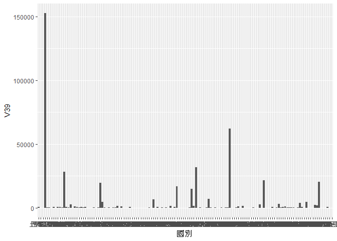
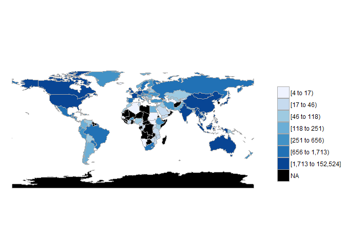
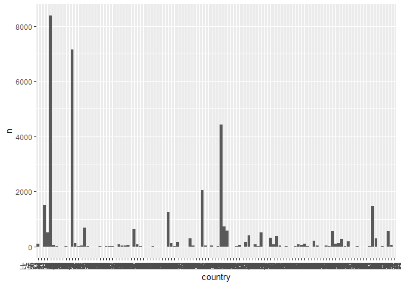
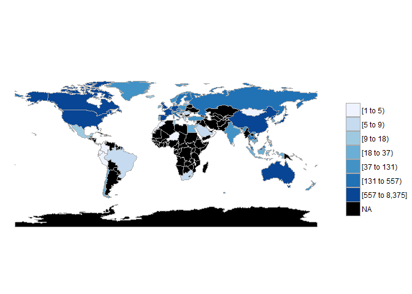
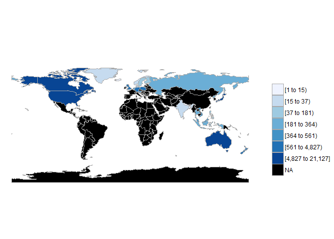

106-2 大數據分析方法 作業二
================
SHUO TIAN

作業完整說明[連結](https://docs.google.com/document/d/1aLGSsGXhgOVgwzSg9JdaNz2qGPQJSoupDAQownkGf_I/edit?usp=sharing)

學習再也不限定在自己出生的國家，台灣每年有許多學生選擇就讀國外的大專院校，同時也有人多國外的學生來台灣就讀，透過分析[大專校院境外學生人數統計](https://data.gov.tw/dataset/6289)、[大專校院本國學生出國進修交流數](https://data.gov.tw/dataset/24730)、[世界各主要國家之我國留學生人數統計表](https://ws.moe.edu.tw/Download.ashx?u=C099358C81D4876CC7586B178A6BD6D5062C39FB76BDE7EC7685C1A3C0846BCDD2B4F4C2FE907C3E7E96F97D24487065577A728C59D4D9A4ECDFF432EA5A114C8B01E4AFECC637696DE4DAECA03BB417&n=4E402A02CE6F0B6C1B3C7E89FDA1FAD0B5DDFA6F3DA74E2DA06AE927F09433CFBC07A1910C169A1845D8EB78BD7D60D7414F74617F2A6B71DC86D17C9DA3781394EF5794EEA7363C&icon=..csv)可以了解103年以後各大專院校國際交流的情形。請同學分析以下議題，並以視覺化的方式呈現分析結果，呈現103年以後大專院校國際交流的情形。

!!!!Interpretation:Because i can import the second data by URL,so i have to import it by direct the loction which document exists on my local PC.And i also do some modifications on execl after import.So when you load this codes,Please adjust the address' code in Line 29.I will also upload the csv which i have modified to github.Thankyou!

來台境外生分析
--------------

### 資料匯入與處理

``` r
library(readr)
library(readODS)
library(RCurl)
```

    ## Loading required package: bitops

``` r
data1031<-read_csv("http://stats.moe.gov.tw/files/detail/103/103_ab103_C.csv")
```

    ## Parsed with column specification:
    ## cols(
    ##   洲別 = col_character(),
    ##   國別 = col_character(),
    ##   `學位生-正式修讀學位外國生` = col_integer(),
    ##   `學位生-僑生(含港澳)` = col_integer(),
    ##   `學位生-正式修讀學位陸生` = col_integer(),
    ##   `非學位生-外國交換生` = col_integer(),
    ##   `非學位生-外國短期研習及個人選讀` = col_integer(),
    ##   `非學位生-大專附設華語文中心學生` = col_integer(),
    ##   `非學位生-大陸研修生` = col_integer(),
    ##   `非學位生-海青班` = col_integer(),
    ##   境外專班 = col_integer()
    ## )

``` r
data1032<-read_csv("http://stats.moe.gov.tw/files/detail/103/103_ab103_S.csv")
```

    ## Parsed with column specification:
    ## cols(
    ##   學校類型 = col_character(),
    ##   學校代碼 = col_character(),
    ##   學校名稱 = col_character(),
    ##   `學位生-正式修讀學位外國生` = col_integer(),
    ##   `學位生-僑生(含港澳)` = col_integer(),
    ##   `學位生-正式修讀學位陸生` = col_integer(),
    ##   `非學位生-外國交換生` = col_integer(),
    ##   `非學位生-外國短期研習及個人選讀` = col_integer(),
    ##   `非學位生-大專附設華語文中心學生` = col_integer(),
    ##   `非學位生-大陸研修生` = col_character(),
    ##   `非學位生-海青班` = col_integer(),
    ##   境外專班 = col_integer()
    ## )

``` r
data1041<-read_csv("http://stats.moe.gov.tw/files/detail/104/104_ab104_C.csv")
```

    ## Parsed with column specification:
    ## cols(
    ##   洲別 = col_character(),
    ##   國別 = col_character(),
    ##   `學位生-正式修讀學位外國生` = col_integer(),
    ##   `學位生-僑生(含港澳)` = col_integer(),
    ##   `學位生-正式修讀學位陸生` = col_integer(),
    ##   `非學位生-外國交換生` = col_integer(),
    ##   `非學位生-外國短期研習及個人選讀` = col_integer(),
    ##   `非學位生-大專附設華語文中心學生` = col_integer(),
    ##   `非學位生-大陸研修生` = col_integer(),
    ##   `非學位生-海青班` = col_integer(),
    ##   境外專班 = col_integer()
    ## )

``` r
data1042<-read_csv("http://stats.moe.gov.tw/files/detail/104/104_ab104_S.csv")
```

    ## Parsed with column specification:
    ## cols(
    ##   學校類型 = col_character(),
    ##   學校代碼 = col_character(),
    ##   學校名稱 = col_character(),
    ##   `學位生-正式修讀學位外國生` = col_integer(),
    ##   `學位生-僑生(含港澳)` = col_integer(),
    ##   `學位生-正式修讀學位陸生` = col_integer(),
    ##   `非學位生-外國交換生` = col_integer(),
    ##   `非學位生-外國短期研習及個人選讀` = col_integer(),
    ##   `非學位生-大專附設華語文中心學生` = col_integer(),
    ##   `非學位生-大陸研修生` = col_character(),
    ##   `非學位生-海青班` = col_integer(),
    ##   境外專班 = col_integer()
    ## )

``` r
data1051<-read_csv("http://stats.moe.gov.tw/files/detail/105/105_ab105_C.csv")
```

    ## Parsed with column specification:
    ## cols(
    ##   洲別 = col_character(),
    ##   國別 = col_character(),
    ##   學位生_正式修讀學位外國生 = col_integer(),
    ##   `學位生_僑生(含港澳)` = col_integer(),
    ##   學位生_正式修讀學位陸生 = col_integer(),
    ##   非學位生_外國交換生 = col_integer(),
    ##   非學位生_外國短期研習及個人選讀 = col_integer(),
    ##   非學位生_大專附設華語文中心學生 = col_integer(),
    ##   非學位生_大陸研修生 = col_integer(),
    ##   非學位生_海青班 = col_integer(),
    ##   境外專班 = col_integer()
    ## )

``` r
data1052<-read_csv("http://stats.moe.gov.tw/files/detail/105/105_ab105_S.csv")
```

    ## Parsed with column specification:
    ## cols(
    ##   學校類型 = col_character(),
    ##   學校代碼 = col_character(),
    ##   學校名稱 = col_character(),
    ##   學位生_正式修讀學位外國生 = col_integer(),
    ##   `學位生_僑生(含港澳)` = col_integer(),
    ##   學位生_正式修讀學位陸生 = col_integer(),
    ##   非學位生_外國交換生 = col_integer(),
    ##   非學位生_外國短期研習及個人選讀 = col_integer(),
    ##   非學位生_大專附設華語文中心學生 = col_integer(),
    ##   非學位生_大陸研修生 = col_integer(),
    ##   非學位生_海青班 = col_integer(),
    ##   境外專班 = col_integer()
    ## )

``` r
data1061<-read_csv("http://stats.moe.gov.tw/files/detail/106/106_ab105_C.csv")
```

    ## Parsed with column specification:
    ## cols(
    ##   洲別 = col_character(),
    ##   國別 = col_character(),
    ##   學位生_正式修讀學位外國生 = col_integer(),
    ##   `學位生_僑生(含港澳)` = col_integer(),
    ##   學位生_正式修讀學位陸生 = col_integer(),
    ##   非學位生_外國交換生 = col_integer(),
    ##   非學位生_外國短期研習及個人選讀 = col_integer(),
    ##   非學位生_大專附設華語文中心學生 = col_integer(),
    ##   非學位生_大陸研修生 = col_integer(),
    ##   非學位生_海青班 = col_integer(),
    ##   境外專班 = col_integer()
    ## )

``` r
data1062<-read_csv("http://stats.moe.gov.tw/files/detail/106/106_ab105_S.csv")
```

    ## Parsed with column specification:
    ## cols(
    ##   學校類型 = col_character(),
    ##   學校代碼 = col_character(),
    ##   學校名稱 = col_character(),
    ##   學位生_正式修讀學位外國生 = col_integer(),
    ##   `學位生_僑生(含港澳)` = col_integer(),
    ##   學位生_正式修讀學位陸生 = col_integer(),
    ##   非學位生_外國交換生 = col_integer(),
    ##   非學位生_外國短期研習及個人選讀 = col_integer(),
    ##   非學位生_大專附設華語文中心學生 = col_integer(),
    ##   非學位生_大陸研修生 = col_integer(),
    ##   非學位生_海青班 = col_integer(),
    ##   境外專班 = col_integer()
    ## )

``` r
data2 <- read_csv("ssyy.csv", 
    locale = locale(encoding = "BIG5"))
```

    ## Parsed with column specification:
    ## cols(
    ##   學年度 = col_integer(),
    ##   學期 = col_integer(),
    ##   設立別 = col_character(),
    ##   學校類別 = col_character(),
    ##   學校代碼 = col_character(),
    ##   學校名稱 = col_character(),
    ##   系所代碼 = col_integer(),
    ##   系所名稱 = col_character(),
    ##   學制 = col_character(),
    ##   `對方學校(機構)國別(地區)` = col_character(),
    ##   中文名稱 = col_character(),
    ##   英文名稱 = col_character(),
    ##   小計 = col_integer(),
    ##   男 = col_integer(),
    ##   女 = col_integer()
    ## )

    ## Warning: 2 parsing failures.
    ## row # A tibble: 2 x 5 col     row col      expected               actual file       expected   <int> <chr>    <chr>                  <chr>  <chr>      actual 1 23579 系所代碼 no trailing characters A2     'ssyy.csv' file 2 34284 系所代碼 no trailing characters A2     'ssyy.csv'

``` r
data3<-read_csv("https://ws.moe.edu.tw/Download.ashx?u=C099358C81D4876CC7586B178A6BD6D5062C39FB76BDE7EC7685C1A3C0846BCDD2B4F4C2FE907C3E7E96F97D24487065577A728C59D4D9A4ECDFF432EA5A114C8B01E4AFECC637696DE4DAECA03BB417&n=4E402A02CE6F0B6C1B3C7E89FDA1FAD0B5DDFA6F3DA74E2DA06AE927F09433CFBC07A1910C169A1845D8EB78BD7D60D7414F74617F2A6B71DC86D17C9DA3781394EF5794EEA7363C&icon=..csv")
```

    ## Warning: Missing column names filled in: 'X4' [4], 'X5' [5], 'X6' [6]

    ## Parsed with column specification:
    ## cols(
    ##   洲別 = col_character(),
    ##   國別 = col_character(),
    ##   總人數 = col_number(),
    ##   X4 = col_character(),
    ##   X5 = col_character(),
    ##   X6 = col_character()
    ## )

``` r
datatotal<-merge(data1031,data1041,by = colnames(data1031[2]))
datatotal<-merge(datatotal,data1051,by=colnames(data1031[2]))
datatotal<-merge(datatotal,data1061,by=colnames(data1031[2]))
```

    ## Warning in merge.data.frame(datatotal, data1061, by =
    ## colnames(data1031[2])): column names '洲別.x', '境外專班.x', '洲別.y', '境
    ## 外專班.y' are duplicated in the result

``` r
datatotal$洲別.y<-NULL
datatotal$洲別.y<-NULL
datatotal[,21]<-NULL
datatotal2<-merge(data1032,data1042,by = colnames(data1032[2]))
datatotal2<-merge(datatotal2,data1052,by=colnames(data1032[2]))
datatotal2<-merge(datatotal2,data1062,by=colnames(data1032[2]))
```

    ## Warning in merge.data.frame(datatotal2, data1062, by =
    ## colnames(data1032[2])): column names '學校類型.x', '學校名稱.x', '境外
    ## 專班.x', '學校類型.y', '學校名稱.y', '境外專班.y' are duplicated in the
    ## result

``` r
datatotal2[,c(10,13,14,21,24,25,35,36)]<-NULL

#這是R Code Chunk
```

### 哪些國家來台灣唸書的學生最多呢？

``` r
a<-datatotal

for(q in 1:139){
  answer<-0
  for(w in 3 :38){
    answer<-answer+a[q,w]}
  a[q,39]<-answer
}
b<-datatotal2
for(q in 1:144){
  answer<-0
  for(w in 4 :37){
    answer<-answer+b[q,w]}
  b[q,38]<-answer
}

library(dplyr)
```

    ## 
    ## Attaching package: 'dplyr'

    ## The following objects are masked from 'package:stats':
    ## 
    ##     filter, lag

    ## The following objects are masked from 'package:base':
    ## 
    ##     intersect, setdiff, setequal, union

``` r
a<-arrange(a,desc(V39))
b<-arrange(b,desc(V38))  

#這是R Code Chunk
library(knitr)
knitr::kable(head(a,10))
```

| 國別     | 洲別.x | 學位生-正式修讀學位外國生.x | 學位生-僑生(含港澳).x | 學位生-正式修讀學位陸生.x | 非學位生-外國交換生.x | 非學位生-外國短期研習及個人選讀.x | 非學位生-大專附設華語文中心學生.x | 非學位生-大陸研修生.x | 非學位生-海青班.x | 境外專班.x | 學位生-正式修讀學位外國生.y | 學位生-僑生(含港澳).y | 學位生-正式修讀學位陸生.y | 非學位生-外國交換生.y | 非學位生-外國短期研習及個人選讀.y | 非學位生-大專附設華語文中心學生.y | 非學位生-大陸研修生.y | 非學位生-海青班.y | 境外專班.y | 學位生\_正式修讀學位外國生.x | 學位生\_僑生(含港澳).x | 學位生\_正式修讀學位陸生.x | 非學位生\_外國交換生.x | 非學位生\_外國短期研習及個人選讀.x | 非學位生\_大專附設華語文中心學生.x | 非學位生\_大陸研修生.x | 非學位生\_海青班.x | 境外專班.x.1 | 學位生\_正式修讀學位外國生.y | 學位生\_僑生(含港澳).y | 學位生\_正式修讀學位陸生.y | 非學位生\_外國交換生.y | 非學位生\_外國短期研習及個人選讀.y | 非學位生\_大專附設華語文中心學生.y | 非學位生\_大陸研修生.y | 非學位生\_海青班.y | 境外專班.y.1 |     V39|
|:---------|:-------|:---------------------------:|:---------------------:|:-------------------------:|:---------------------:|:---------------------------------:|:---------------------------------:|:---------------------:|:-----------------:|:----------:|:---------------------------:|:---------------------:|:-------------------------:|:---------------------:|:---------------------------------:|:---------------------------------:|:---------------------:|:-----------------:|:----------:|:----------------------------:|:----------------------:|:--------------------------:|:----------------------:|:----------------------------------:|:----------------------------------:|:----------------------:|:------------------:|:------------:|:----------------------------:|:----------------------:|:--------------------------:|:----------------------:|:----------------------------------:|:----------------------------------:|:----------------------:|:------------------:|:------------:|-------:|
| 中國大陸 | 亞洲   |              0              |           0           |            5881           |           0           |                 0                 |                377                |         27030         |         0         |      0     |              0              |           0           |            7813           |           0           |                 0                 |                 24                |         34114         |         0         |      0     |               0              |            0           |            9327            |            0           |                  0                 |                  6                 |          32648         |          0         |       0      |               0              |            0           |            9462            |            0           |                  0                 |                 18                 |          25824         |          0         |       0      |  152524|
| 馬來西亞 | 亞洲   |             3671            |          6254         |             0             |           35          |                839                |                 85                |           0           |        2402       |     99     |             4465            |          7053         |             0             |           38          |                848                |                247                |           0           |        2291       |     112    |             5044             |          7645          |              0             |           53           |                 946                |                 261                |            0           |        2215        |      147     |             5449             |          7984          |              0             |           53           |                 946                |                 338                |            0           |        2309        |      202     |   62031|
| 香港     | 亞洲   |              0              |          5814         |             0             |          193          |                220                |                 59                |           0           |         0         |      0     |              0              |          7333         |             0             |          188          |                205                |                507                |           0           |         0         |      0     |               0              |          8190          |              0             |           149          |                 242                |                 79                 |            0           |          0         |       0      |               0              |          8329          |              0             |           149          |                 242                |                 41                 |            0           |          0         |       0      |   31940|
| 日本     | 亞洲   |             698             |          177          |             0             |          494          |                1423               |                3024               |           0           |         0         |      0     |             791             |          175          |             0             |          499          |                1554               |                3436               |           0           |         0         |      0     |              931             |           177          |              0             |           561          |                1486                |                4387                |            0           |          0         |       0      |             1183             |           157          |              0             |           561          |                1486                |                5000                |            0           |          0         |       0      |   28200|
| 越南     | 亞洲   |             2450            |          291          |             0             |           11          |                 41                |                922                |           0           |         0         |     290    |             2586            |          307          |             0             |           50          |                 47                |                1096               |           0           |         0         |     373    |             2807             |           358          |              0             |           34           |                 277                |                1512                |            0           |          0         |      354     |             3884             |           581          |              0             |           34           |                 277                |                2541                |            0           |         22         |      525     |   21670|
| 澳門     | 亞洲   |              0              |          4693         |             0             |           10          |                 3                 |                 17                |           0           |         0         |      0     |              0              |          5001         |             0             |           21          |                 12                |                118                |           0           |         0         |      0     |               0              |          5259          |              0             |           19           |                  5                 |                  3                 |            0           |          0         |       0      |               0              |          5116          |              0             |           19           |                  5                 |                  1                 |            0           |          0         |       0      |   20302|
| 印尼     | 亞洲   |             1374            |          971          |             0             |           35          |                134                |                976                |           0           |         69        |      0     |             1623            |          1101         |             0             |           68          |                162                |                1442               |           0           |         58        |      0     |             1923             |          1208          |              0             |           113          |                 197                |                1626                |            0           |         87         |       0      |             2662             |          1401          |              0             |           113          |                 197                |                1959                |            0           |         121        |       0      |   19620|
| 南韓     | 亞洲   |             511             |          186          |             0             |          708          |                248                |                1933               |           0           |         1         |      0     |             596             |          196          |             0             |          781          |                417                |                2070               |           0           |         2         |      0     |              668             |           188          |              0             |           708          |                 441                |                2568                |            0           |          2         |       0      |              746             |           170          |              0             |           708          |                 441                |                2658                |            0           |          1         |       0      |   16948|
| 美國     | 美洲   |             419             |          259          |             0             |          182          |                467                |                1998               |           0           |         3         |      0     |             433             |          256          |             0             |          142          |                707                |                2462               |           0           |         3         |      0     |              434             |           222          |              0             |           145          |                 403                |                2495                |            0           |          2         |       0      |              430             |           216          |              0             |           145          |                 403                |                2618                |            0           |          2         |       0      |   14846|
| 泰國     | 亞洲   |             548             |          268          |             0             |          108          |                150                |                461                |           0           |         0         |      0     |             506             |          260          |             0             |          129          |                241                |                455                |           0           |         0         |      0     |              544             |           240          |              0             |           146          |                 246                |                 595                |            0           |          0         |       0      |              635             |           212          |              0             |           146          |                 246                |                 884                |            0           |          2         |      13      |    7035|

### 哪間大學的境外生最多呢？

``` r
knitr::kable(head(b,10))
```

| 學校代碼 | 學校類型.x | 學校名稱.x       | 學位生-正式修讀學位外國生.x | 學位生-僑生(含港澳).x | 學位生-正式修讀學位陸生.x | 非學位生-外國交換生.x | 非學位生-外國短期研習及個人選讀.x | 非學位生-大專附設華語文中心學生.x | 非學位生-海青班.x | 境外專班.x | 學位生-正式修讀學位外國生.y | 學位生-僑生(含港澳).y | 學位生-正式修讀學位陸生.y | 非學位生-外國交換生.y | 非學位生-外國短期研習及個人選讀.y | 非學位生-大專附設華語文中心學生.y | 非學位生-海青班.y | 境外專班.y | 學位生\_正式修讀學位外國生.x | 學位生\_僑生(含港澳).x | 學位生\_正式修讀學位陸生.x | 非學位生\_外國交換生.x | 非學位生\_外國短期研習及個人選讀.x | 非學位生\_大專附設華語文中心學生.x | 非學位生\_大陸研修生.x | 非學位生\_海青班.x | 境外專班.x.1 | 學位生\_正式修讀學位外國生.y | 學位生\_僑生(含港澳).y | 學位生\_正式修讀學位陸生.y | 非學位生\_外國交換生.y | 非學位生\_外國短期研習及個人選讀.y | 非學位生\_大專附設華語文中心學生.y | 非學位生\_大陸研修生.y | 非學位生\_海青班.y | 境外專班.y.1 |    V38|
|:---------|:-----------|:-----------------|:---------------------------:|:---------------------:|:-------------------------:|:---------------------:|:---------------------------------:|:---------------------------------:|:-----------------:|:----------:|:---------------------------:|:---------------------:|:-------------------------:|:---------------------:|:---------------------------------:|:---------------------------------:|:-----------------:|:----------:|:----------------------------:|:----------------------:|:--------------------------:|:----------------------:|:----------------------------------:|:----------------------------------:|:----------------------:|:------------------:|:------------:|:----------------------------:|:----------------------:|:--------------------------:|:----------------------:|:----------------------------------:|:----------------------------------:|:----------------------:|:------------------:|:------------:|------:|
| 0004     | 大專校院   | 國立臺灣師範大學 |             496             |          537          |             45            |          100          |                127                |                3343               |         0         |      0     |             502             |          573          |             82            |          137          |                 79                |                3955               |         0         |      0     |              558             |           617          |             109            |           99           |                  0                 |                4326                |            0           |          0         |       0      |              598             |           662          |             133            |           99           |                  0                 |                4936                |            0           |          0         |       0      |  22113|
| 0003     | 大專校院   | 國立臺灣大學     |             686             |          1051         |            315            |          708          |                296                |                744                |         0         |      0     |             695             |          1074         |            380            |          788          |                656                |                921                |         0         |      0     |              793             |          1132          |             421            |           802          |                 628                |                1041                |            0           |          0         |       0      |              871             |          1297          |             447            |           802          |                 628                |                1023                |            0           |          0         |       0      |  18199|
| 1006     | 大專校院   | 中國文化大學     |             370             |          639          |            344            |          163          |                 8                 |                2354               |        259        |      0     |             302             |          723          |            417            |          176          |                 14                |                2326               |        230        |      0     |              330             |           718          |             487            |           154          |                  8                 |                2123                |            0           |         226        |       0      |              359             |           717          |             467            |           154          |                  8                 |                1774                |            0           |         224        |       0      |  16074|
| 1016     | 大專校院   | 銘傳大學         |             802             |          686          |            419            |          124          |                719                |                276                |        426        |      0     |             802             |          758          |            519            |          113          |                1008               |                482                |        470        |      0     |              805             |           760          |             595            |           137          |                1013                |                 413                |            0           |         436        |       0      |              797             |           773          |             553            |           137          |                1013                |                 522                |            0           |         499        |       0      |  16057|
| 1005     | 大專校院   | 淡江大學         |             321             |          848          |            411            |           78          |                 0                 |                1328               |         0         |      0     |             394             |          946          |            497            |          109          |                 0                 |                1308               |         0         |      0     |              475             |           998          |             586            |           114          |                  0                 |                1554                |            0           |          0         |       0      |              550             |           945          |             528            |           114          |                  0                 |                1783                |            0           |          0         |       0      |  13887|
| 0001     | 大專校院   | 國立政治大學     |             488             |          483          |            194            |          570          |                 68                |                902                |         0         |      0     |             518             |          547          |            282            |          513          |                 76                |                935                |         0         |      0     |              534             |           588          |             319            |           572          |                 66                 |                 910                |            0           |          0         |       0      |              537             |           622          |             344            |           572          |                 66                 |                 920                |            0           |          0         |       0      |  11626|
| 0005     | 大專校院   | 國立成功大學     |             572             |          570          |            108            |           57          |                 69                |                1009               |         0         |      0     |             629             |          610          |            136            |           39          |                 61                |                1079               |         0         |      0     |              753             |           641          |             137            |           66           |                 208                |                1059                |            0           |          0         |       0      |              828             |           677          |             162            |           66           |                 208                |                1238                |            0           |          0         |       0      |  10982|
| 1002     | 大專校院   | 輔仁大學         |             167             |          594          |            419            |          115          |                 21                |                960                |         0         |      0     |             209             |          639          |            522            |          128          |                 0                 |                773                |         0         |      0     |              223             |           694          |             627            |           150          |                  0                 |                 824                |            0           |          0         |       0      |              225             |           667          |             612            |           150          |                  0                 |                 780                |            0           |          0         |       0      |   9499|
| 1007     | 大專校院   | 逢甲大學         |             464             |          463          |            319            |           42          |                 25                |                366                |        353        |      0     |             477             |          565          |            420            |           45          |                280                |                367                |        325        |      0     |              497             |           617          |             479            |           31           |                 81                 |                 443                |            0           |         292        |       0      |              536             |           660          |             445            |           31           |                 81                 |                 491                |            0           |         279        |       0      |   9474|
| 1004     | 大專校院   | 中原大學         |             231             |          260          |            284            |           44          |                 92                |                442                |         0         |      0     |             243             |          382          |            353            |           48          |                155                |                522                |         0         |      0     |              259             |           472          |             394            |           50           |                 130                |                 690                |            0           |          0         |       0      |              301             |           555          |             367            |           50           |                 130                |                1208                |            0           |          0         |       0      |   7662|

``` r
#這是R Code Chunk
```

### 各個國家來台灣唸書的學生人數條狀圖

``` r
a$國別<-as.factor(a$國別)
library(ggplot2)
ggplot()+geom_bar(data=a,aes(x=國別,y=V39),
                  stat = "identity")
```



``` r
#這是R Code Chunk
```

### 各個國家來台灣唸書的學生人數面量圖

``` r
#這是R Code Chunk

library(RJSONIO)
library(choroplethr)
```

    ## Loading required package: acs

    ## Loading required package: stringr

    ## Loading required package: XML

    ## 
    ## Attaching package: 'acs'

    ## The following object is masked from 'package:dplyr':
    ## 
    ##     combine

    ## The following object is masked from 'package:base':
    ## 
    ##     apply

``` r
library(ggplot2)
a1<-data.frame(a$國別,a$V39)
CountriesComparisionTable <- read_csv("C:/Users/tsv587/Desktop/CountriesComparisionTable.csv")
```

    ## Parsed with column specification:
    ## cols(
    ##   ISO3 = col_character(),
    ##   English = col_character(),
    ##   Taiwan = col_character()
    ## )

``` r
country<-CountriesComparisionTable[,-1]
colnames(a1)[1]<-"region"
colnames(country)[1]<-"value"
colnames(country)[2]<-"region"
a1<-merge(country,a1,by="region")
a1<-a1[,-1]
colnames(a1)[1]<-"region"
colnames(a1)[2]<-"value"


a2<-group_by(a1,region)%>%
  summarise(value=sum(value))

country_choropleth(a2)
```

    ## Warning in super$initialize(country.map, user.df): Your data.frame contains
    ## the following regions which are not mappable: Singapore, Unmatch

    ## Warning in self$bind(): The following regions were missing and are being
    ## set to NA: afghanistan, angola, moldova, madagascar, mali, montenegro,
    ## mauritania, burundi, niger, oman, qatar, western sahara, sierra leone,
    ## somaliland, somalia, suriname, chad, togo, east timor, trinidad and tobago,
    ## taiwan, the bahamas, vanuatu, zambia, albania, botswana, central african
    ## republic, democratic republic of the congo, northern cyprus, cyprus,
    ## djibouti, eritrea, gabon, georgia, ghana, antarctica, guinea, guinea
    ## bissau, equatorial guinea, guyana, jamaica, south korea, kosovo, lebanon,
    ## liberia, libya, lesotho



台灣學生國際交流分析
--------------------

### 資料匯入與處理

``` r
library(dplyr)
datause<-filter(data2,學年度>102)
colnames(datause)[10]<-"country"

colnames(datause)[11]<-"school"

data5<-group_by(datause,school)%>%
  summarise(n=sum(小計))

data4<-group_by(datause,country)%>%
  summarise(n=sum(小計))

result1<-arrange(data4,desc(n))
result2<-arrange(data5,desc(n))


#這是R Code Chunk
```

### 台灣大專院校的學生最喜歡去哪些國家進修交流呢？

``` r
knitr::kable(head(result1,10))
```

| country  |     n|
|:---------|-----:|
| 中國大陸 |  8375|
| 日本     |  7142|
| 美國     |  4427|
| 南韓     |  2050|
| 大陸地區 |  1516|
| 德國     |  1466|
| 法國     |  1258|
| 英國     |   742|
| 加拿大   |   689|
| 西班牙   |   642|

``` r
#這是R Code Chunk
```

### 哪間大學的出國交流學生數最多呢？

``` r
knitr::kable(head(result2,10))
```

| school       |    n|
|:-------------|----:|
| 同濟大學     |  462|
| 上海交通大學 |  403|
| 北京大學     |  305|
| 復旦大學     |  299|
| 南京大學     |  284|
| 廈門大學     |  267|
| NA           |  264|
| 集美大學     |  256|
| 中國人民大學 |  225|
| 吉林大學     |  209|

``` r
#這是R Code Chunk
```

### 台灣大專院校的學生最喜歡去哪些國家進修交流條狀圖

``` r
result1$country<-as.factor(result1$country)
library(ggplot2)
ggplot()+geom_bar(data=result1,aes(x=country,y=n),
                  stat = "identity")
```



``` r
#這是R Code Chunk
```

### 台灣大專院校的學生最喜歡去哪些國家進修交流面量圖

``` r
colnames(result1)[1]<-"region"
colnames(result1)[2]<-"value"
answer1<-merge(country,result1,by="region")
answer1<-answer1[,-1]
colnames(answer1)[1]<-"region"
colnames(answer1)[2]<-"value"
answer2<-group_by(answer1,region)%>%
  summarise(value=sum(value))

country_choropleth(answer2)
```

    ## Warning in super$initialize(country.map, user.df): Your data.frame contains
    ## the following regions which are not mappable: Singapore, Unmatch

    ## Warning in self$bind(): The following regions were missing and are being
    ## set to NA: afghanistan, angola, azerbaijan, moldova, madagascar, macedonia,
    ## mali, myanmar, montenegro, mozambique, mauritania, burundi, namibia,
    ## nigeria, nicaragua, pakistan, papua new guinea, benin, paraguay, rwanda,
    ## western sahara, sudan, burkina faso, south sudan, senegal, sierra leone,
    ## el salvador, somaliland, somalia, suriname, syria, chad, togo, tajikistan,
    ## turkmenistan, east timor, bulgaria, trinidad and tobago, taiwan, united
    ## republic of tanzania, uganda, ukraine, uruguay, uzbekistan, the bahamas,
    ## venezuela, vanuatu, yemen, zambia, zimbabwe, bosnia and herzegovina,
    ## belarus, albania, belize, bolivia, bhutan, botswana, central african
    ## republic, united arab emirates, ivory coast, cameroon, democratic republic
    ## of the congo, republic of congo, cuba, northern cyprus, cyprus, argentina,
    ## djibouti, dominican republic, algeria, eritrea, armenia, ethiopia,
    ## fiji, gabon, georgia, ghana, antarctica, guinea, gambia, guinea bissau,
    ## equatorial guinea, guatemala, guyana, honduras, haiti, iran, iraq, jamaica,
    ## kazakhstan, kenya, kyrgyzstan, kosovo, laos, lebanon, liberia, libya,
    ## lesotho, luxembourg



``` r
#這是R Code Chunk
```

台灣學生出國留學分析
--------------------

### 資料匯入與處理

``` r
library(dplyr)
a4<-data3
colnames(a4)[2]<-"country"
a5<-group_by(a4,country)%>%
  summarise(n<-sum(總人數))
colnames(a5)[2]<-"n"
a5<-arrange(a5,desc(n))


#這是R Code Chunk
```

### 台灣學生最喜歡去哪些國家留學呢？

``` r
knitr::kable(head(a5,10))
```

| country  |      n|
|:---------|------:|
| 美國     |  21127|
| 澳大利亞 |  13582|
| 日本     |   8444|
| 加拿大   |   4827|
| 英國     |   3815|
| 德國     |   1488|
| 紐西蘭   |   1106|
| 波蘭     |    561|
| 馬來西亞 |    502|
| 奧地利   |    419|

``` r
#這是R Code Chunk
```

### 台灣學生最喜歡去哪些國家留學面量圖

``` r
colnames(a5)[1]<-"region"
colnames(a5)[2]<-"value"
a5<-merge(country,a5,by="region")
a5<-a5[,-1]
colnames(a5)[1]<-"region"
colnames(a5)[2]<-"value"
a6<-group_by(a5,region)%>%
  summarise(value=sum(value))

country_choropleth(a6)
```

    ## Warning in super$initialize(country.map, user.df): Your data.frame contains
    ## the following regions which are not mappable: Singapore

    ## Warning in self$bind(): The following regions were missing and are being
    ## set to NA: afghanistan, angola, azerbaijan, moldova, madagascar, mexico,
    ## macedonia, mali, myanmar, montenegro, mongolia, mozambique, mauritania,
    ## burundi, malawi, namibia, france, niger, nigeria, nicaragua, oman,
    ## pakistan, panama, peru, papua new guinea, benin, portugal, paraguay,
    ## israel, qatar, romania, rwanda, western sahara, saudi arabia, sudan,
    ## burkina faso, south sudan, senegal, solomon islands, sierra leone, el
    ## salvador, somaliland, somalia, republic of serbia, suriname, slovakia,
    ## slovenia, swaziland, syria, chad, togo, tajikistan, turkmenistan, east
    ## timor, bulgaria, trinidad and tobago, tunisia, turkey, taiwan, united
    ## republic of tanzania, uganda, ukraine, uruguay, uzbekistan, the bahamas,
    ## venezuela, vanuatu, yemen, south africa, zambia, zimbabwe, bosnia and
    ## herzegovina, belarus, albania, belize, bolivia, brazil, bhutan, botswana,
    ## central african republic, switzerland, chile, united arab emirates, china,
    ## ivory coast, cameroon, democratic republic of the congo, republic of
    ## congo, colombia, costa rica, cuba, northern cyprus, cyprus, argentina,
    ## czech republic, djibouti, dominican republic, algeria, ecuador, egypt,
    ## eritrea, spain, armenia, estonia, ethiopia, fiji, gabon, georgia, ghana,
    ## antarctica, guinea, gambia, guinea bissau, equatorial guinea, greece,
    ## guatemala, guyana, honduras, croatia, haiti, hungary, ireland, iran, iraq,
    ## italy, jamaica, jordan, kazakhstan, kenya, kyrgyzstan, cambodia, south
    ## korea, kosovo, kuwait, laos, lebanon, liberia, libya, lesotho, lithuania,
    ## luxembourg, latvia, morocco



``` r
#這是R Code Chunk
```

綜合分析
--------

請問來台讀書與離台讀書的來源國與留學國趨勢是否相同(5分)？想來台灣唸書的境外生，他們的母國也有很多台籍生嗎？請圖文並茂說明你的觀察(10分)。

I think the tendency is the same ,because you can find than the picture 1st and 2nd are quitely similar,these two pictures respectively show the countries which Taiwanese students go abord for studying and which countries' students come to Taiwan for studying. You can find the Amercia,China ,Japan,SOuth korean,Austrlia,Canada,UK,Franch,Germany,Spinish are all in dark color in both three pictures. These improve that the country which has lots of Taiwanese students alse has lots of native students go to Taiwan for study.
